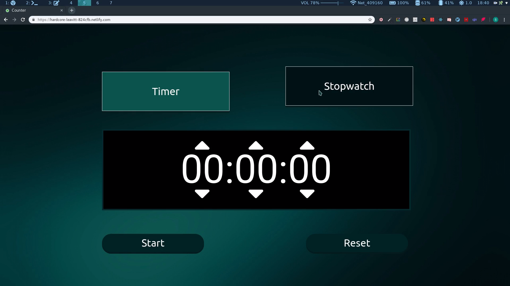

## <u>Timer and stopwatch</u>

Timer and stopwatch is an accurate app for measuring time. It has a simple and easy to use design with the option to pause and continue counting later. App is made with HTML5, CSS3(SCSS) and React.

**Live page:** <a  href="https://projects.darkokojovic.com/counter/">here</a>

#### <u>Video</u>:

<!-- <iframe src="https://player.vimeo.com/video/352302730"  width="800"  height="455"  frameborder="0"  allow="autoplay; fullscreen"  allowfullscreen></iframe> -->

#### <u>Technologies used:</u>

- HTML5

- CSS3(Sass)

- Javascript(ReactJS)
